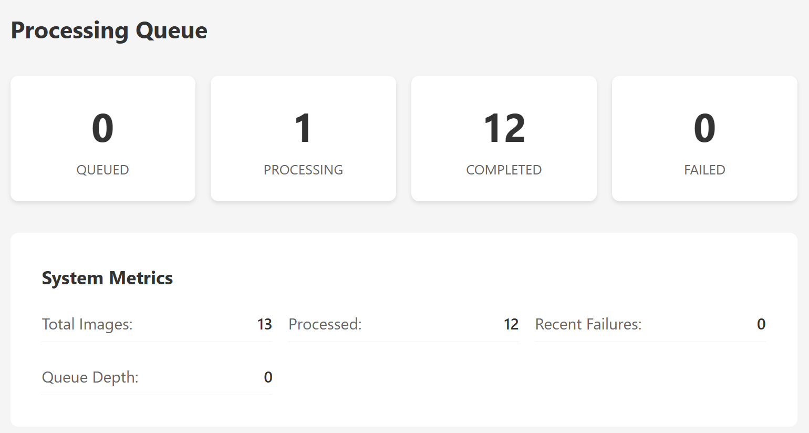

# PXLCensor

A web-based face anonymization service that automatically detects and blurs, pixelates, or blocks faces in uploaded images.

## Overview

PXLCensor provides an easy-to-use interface for anonymizing faces in photos. Upload an image, select your preferred anonymization method, and download the processed result. The service runs entirely on your own infrastructure with no external dependencies.

## Features

- Multiple anonymization methods: mosaic pixelation, blur, solid blocks
- Configurable mosaic size (1-120 pixels)
- Automatic face detection using neural networks
- Processing queue with real-time status updates
- Image gallery with processing history
- Complete file management including deletion
- Docker-based deployment

## How It Works

1. Upload an image through the web interface
2. Select anonymization method and settings
3. The system queues the image for processing
4. A background worker uses the deface library to detect faces
5. Anonymization filters are applied to detected face regions
6. Download the processed image or view it in the gallery

For detailed technical information, see the [Technical Specification](TECH_SPEC.md).

## Architecture

The application consists of five services:

- **Frontend**: Vue.js web interface
- **API**: Node.js REST API server
- **Processor**: Background worker for image processing
- **Media**: File storage service with signed URLs
- **Database**: PostgreSQL with job queue

## Services

**Frontend Service**: Vue 3 single-page application with Vite build system. Provides drag-and-drop upload interface, real-time processing status, image gallery with pagination, and detailed image view modal. Served as static files by the API service in production.

**API Service**: Node.js/Fastify REST API that orchestrates the entire application. Handles file upload initialization, job queue management, database operations, and serves the frontend. Uses PostgreSQL LISTEN/NOTIFY for real-time job notifications and HMAC signatures for secure media operations.

**Processor Service**: Background worker that consumes jobs from the PostgreSQL queue. Downloads images via signed URLs, processes them using the Python deface library with configurable anonymization methods, and uploads results back to media storage. Supports automatic scaling based on image size.

**Media Service**: Dedicated file storage service that manages all filesystem operations. Provides signed URL generation for secure uploads and downloads, handles both original and processed image storage, and maintains atomic file operations for data integrity.

**Database Service**: PostgreSQL 16 with UUID extension providing persistent storage for image metadata, job queue with LISTEN/NOTIFY pub/sub, processing status tracking, and audit logging. Uses atomic functions for reliable job claiming and completion.

## Processing Methods

**Mosaic**: Replaces faces with pixelated blocks. Mosaic size can be adjusted from 1 to 120 pixels.

**Blur**: Applies Gaussian blur to face regions.

**Solid**: Covers faces with solid black rectangles.

## Performance Optimization

The system automatically optimizes processing based on image size:

- Small images (under 2MB): High-resolution inference for maximum accuracy
- Medium images (2-10MB): Balanced resolution for good performance
- Large images (over 10MB): Lower resolution inference to prevent memory issues

Face detection runs at optimized resolution while maintaining original output quality.

## Requirements

- Docker and Docker Compose
- 2GB+ RAM recommended for image processing
- Modern web browser with JavaScript enabled

## Quick Start

1. Clone the repository
2. Run `docker-compose up -d`
3. Open <http://localhost:8080> in your browser
4. Upload an image and select processing options

## Configuration

Environment variables can be set in docker-compose.yml:

- `DATABASE_URL`: PostgreSQL connection string
- `MEDIA_SIGNING_SECRET`: Secret key for file access signatures
- `PROCESSOR_CONCURRENCY`: Number of concurrent processing jobs

## API Endpoints

- `POST /api/upload`: Upload new image
- `GET /api/images`: List processed images with pagination
- `GET /api/images/:id`: Get image details
- `DELETE /api/images/:id`: Delete image and all associated files
- `GET /api/jobs/:id/status`: Check processing status

## Technology Stack

- **Frontend**: Vue 3, Vite, Axios
- **Backend**: Node.js, Fastify, PostgreSQL
- **Processing**: Python deface library with ONNX neural networks
- **Storage**: Local filesystem with HMAC-signed URLs
- **Queue**: PostgreSQL LISTEN/NOTIFY

## File Storage

Images are stored in two directories:

- `media-data/originals/`: Original uploaded files
- `media-data/processed/`: Anonymized output files

All file access is secured with HMAC-signed URLs that expire after a configurable time period.

## Database Schema

The system uses PostgreSQL with these main tables:

- `images`: Metadata for uploaded images
- `jobs`: Processing queue with status tracking

Processing options are stored as JSONB for flexibility.

## Development

Each service can be developed independently:

- Frontend runs on port 8080
- API server on port 3000
- Media service on port 8081
- PostgreSQL on port 5432

Logs can be viewed with `docker-compose logs <service-name>`.

## Limitations

- Only image files are supported (JPEG, PNG, etc.)
- Processing time depends on image size and face count
- Face detection accuracy varies with image quality and lighting
- Very high resolution images may require additional memory

## License

This project is licensed under the MIT License.